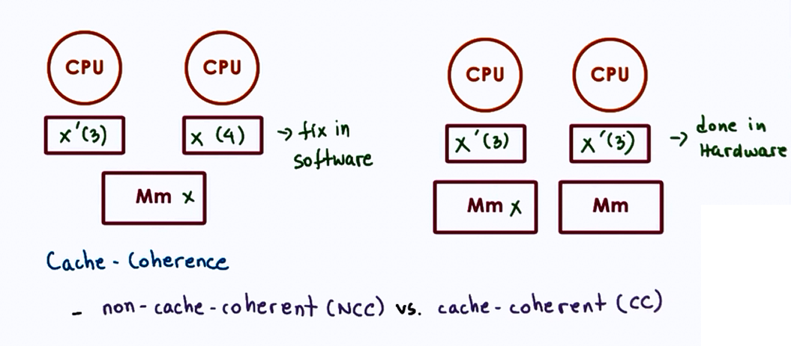
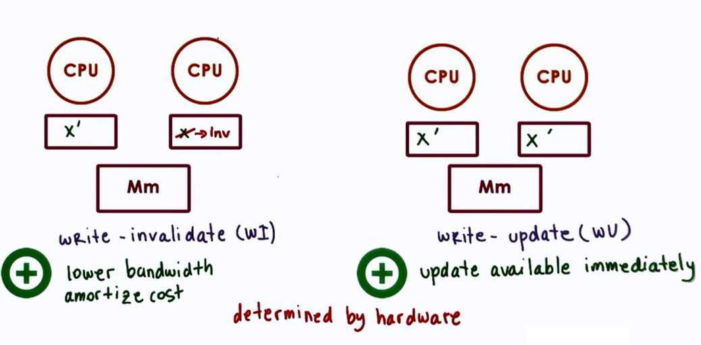

# Synchronization

Waiting for other processes, so that they can continue working together

- may repeatedly check to continue
	- sync using spinlocks
- may wait for a signal to continue
	- sync using mutexes and condition vatiables
- waiting hurts performance
	- CPUs wste cycles for checking; cache effects
    
## Limitation of mutextes and condition variables

- Error prone/correctness/ease of use
	- unlock wrong mutex, signal wrong condition variable
- Lack of expressive power
	- helper variables for access or priority control
    
Low-level support: hardware atmoic instructions

## Synchronization constructs

1. Spinlocks (basic sync construct)
	- Spinlock is like a mutex 
    	- mutual exclusion
        - lock and unlock(free)
   	- but, lock == busy => spinning
2. Semaphores
	- common sync construct in OS kernels
    - like a traffic light: Stop and Go
    - like mutex, but more general
    
Semaphore == integer value

* on init
	- assigned a max value (positive int) => max count
* on try(wait)
	- if non-zero, decrement and proceed => counting semaphore
* if initialized with 1
	- semaphore == mutex(binary semaphore)
* on exit(post)
	- increment
    
## Syncing different types of accesses

### Reader/Writer locks

<table>
<tr>
<td>read (don't modify)</td>
<td>write (always modify)</td>
</tr>
<tr>
<td>shared access</td>
<td>exclusive access</td>
</tr>
</table>

* RW locks
	- specify type of access, then lock behaves accordingly
    
### Monitors (highlevel construct)
- shared resource
- entry resource
- possible condition variables
* On entry:
	- lock, check
* On exit:
	- unlock, check, signal
    
### More synchroniaztion constructs    
* serializers
* path expressions
* barriers
* rendezvous points
* optimistic wait-free sync (RCU) [Read Copy Update]

All need hardware support.

## Need for hardware support

- Problem 
	- concurrent check/update on different CPUs can overlap
    
### Atomic instructions
 Critical section with hardware supported synchronization
 
#### Hardware specific
* test-and-set
	- returns(tests) original values and sets new-value!= 1 (busy) automatically
    - first thread: test-and-set(lock) => 0 : free
    - next ones: test-and-set(lock) => 1 busy
    	- reset lock to 1, but that's okay
     - **\+** : Latency 
     - **\+** : minimal (Atomic)
     - **\+** : Delay potentially min
     - **\-** : Contention processors go to memory on each spin 
			- To reduce contention, introduce delay
        	  - Static(based on a fixed value) or Dynamic(backoff based, random delay)
     
        
* read-and-increment
* compare-and-swap

#### Guarantees
* atomicity
* mutual exclusion
* queue all concurrent instructions but one
    

### Shared Memory Multiprocessors

Also called symmetric multiprocessors (SMP)

* Caches 
	- hide memory latency, "memory" further away due to contention
	- no-write, write-through, write-back   

### Cache Coherence

    
    
    
    